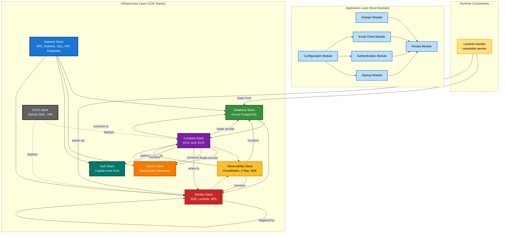
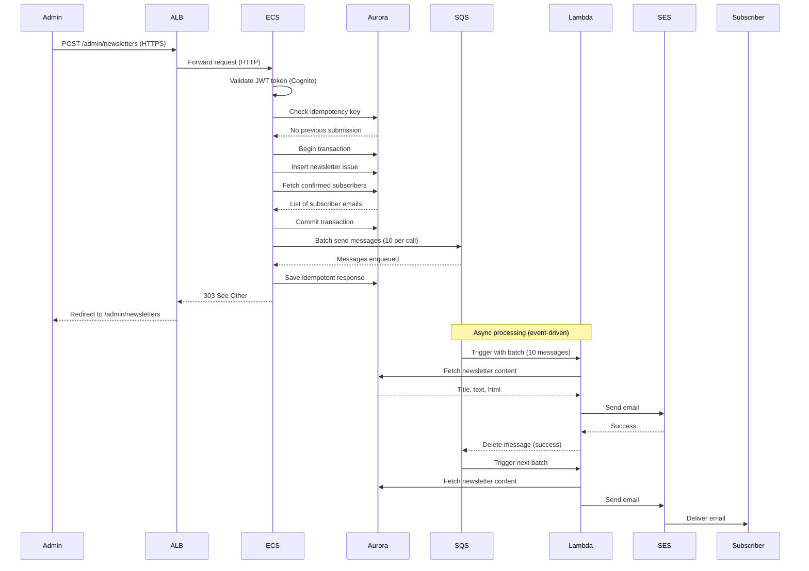
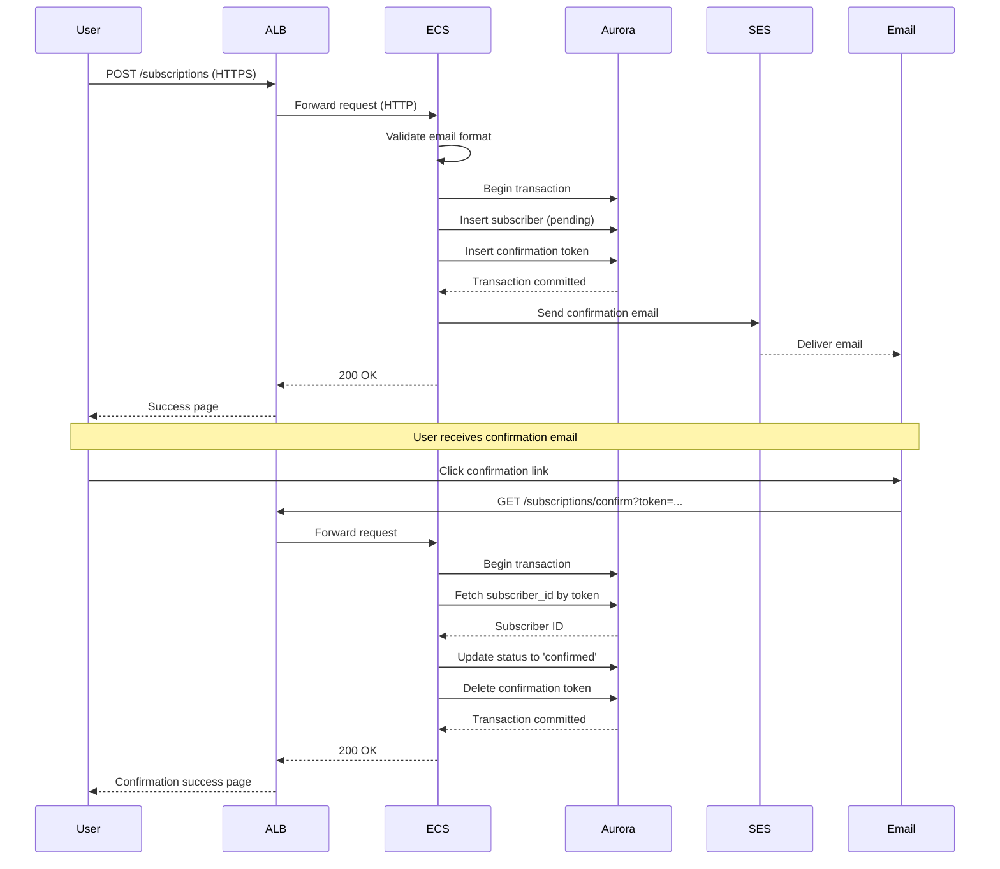
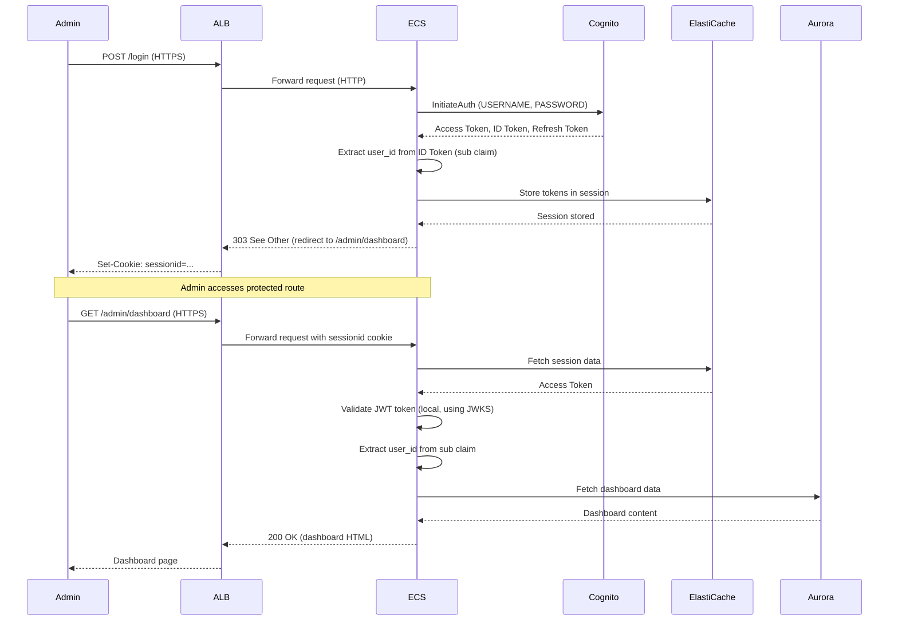
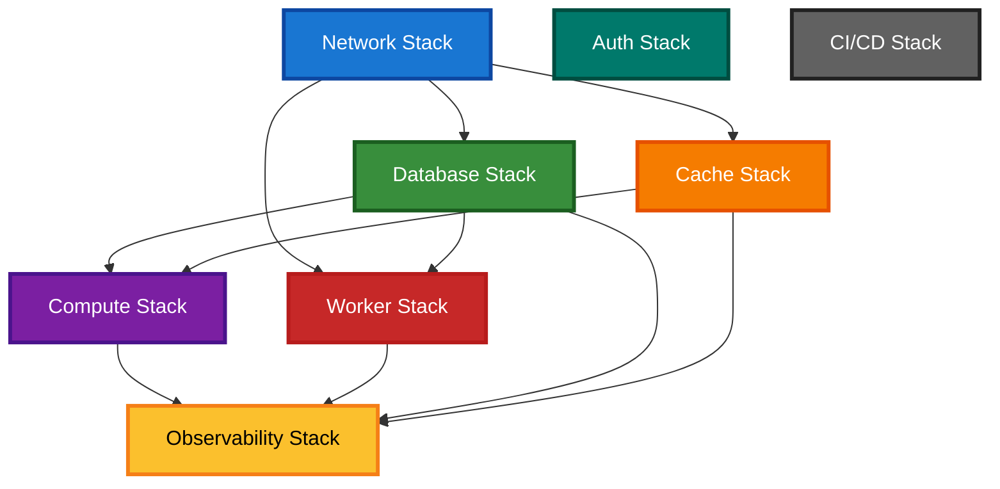
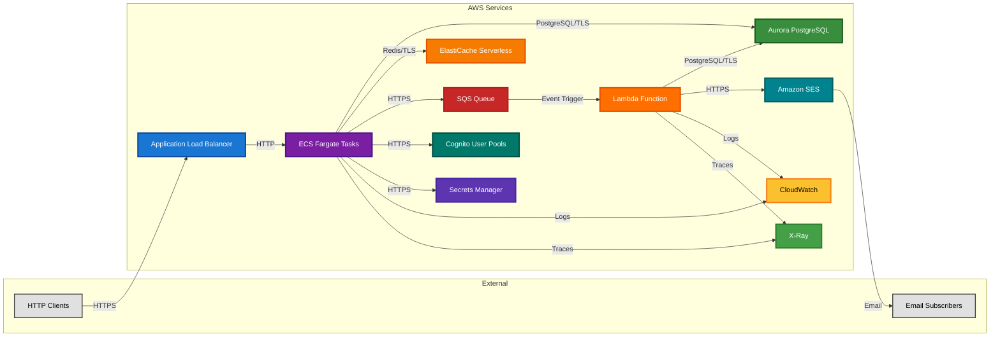

# Component Dependencies

## Overview

This document defines the component dependency graph for the AWS modernized architecture, covering both deployment dependencies (which CDK stacks depend on others) and runtime dependencies (which services call which services).

---

## Component Dependency Graph

### High-Level Dependency Visualization



---

## Deployment Dependencies (CDK Stack Order)

Deployment dependencies determine the order in which CDK stacks must be deployed. A stack can only be deployed after all its dependencies are successfully deployed.

### Deployment Order

**Phase 1: Foundation**
1. **Network Stack** (no dependencies)
   - Creates VPC, subnets, security groups, VPC endpoints
   - All other stacks depend on networking resources

**Phase 2: Data Layer**
2. **Database Stack** (depends on: Network)
   - Requires VPC ID, private subnets, Aurora security group
3. **Cache Stack** (depends on: Network)
   - Requires VPC ID, private subnets, ElastiCache security group

**Phase 3: Authentication**
4. **Auth Stack** (no infrastructure dependencies, but logically after Network)
   - Creates Cognito User Pool (no VPC integration)
   - Independent deployment, but needed by Compute Stack

**Phase 4: Compute Layer**
5. **Compute Stack** (depends on: Network, Database, Cache)
   - Requires VPC, subnets, security groups
   - Requires database secret ARN (from Database Stack)
   - Requires cache secret ARN (from Cache Stack)
   - Needs Auth Stack for Cognito User Pool ID (runtime dependency)

**Phase 5: Worker Layer**
6. **Worker Stack** (depends on: Network, Database)
   - Requires VPC ID, private subnets, Lambda security group
   - Requires database secret ARN (for Lambda)
   - Creates SQS queue (used by Compute Stack at runtime)

**Phase 6: Observability & CI/CD**
7. **Observability Stack** (depends on: Compute, Worker, Database, Cache)
   - Requires ALB ARN, ECS service name, Aurora cluster ID, Lambda function name
   - Creates dashboards and alarms for deployed resources
8. **CI/CD Stack** (no dependencies)
   - Creates GitHub OIDC provider and IAM role
   - Independent deployment

### Deployment Dependency Matrix

| Stack | Depends On | Provides To |
|-------|-----------|-------------|
| Network | None | Database, Cache, Compute, Worker, Auth |
| Database | Network | Compute, Worker, Observability |
| Cache | Network | Compute, Observability |
| Auth | None | Compute (runtime) |
| Compute | Network, Database, Cache | Worker (runtime), Observability |
| Worker | Network, Database | Compute (runtime), Observability |
| Observability | Compute, Worker, Database, Cache | Monitoring system |
| CI/CD | None | All stacks (deployment pipeline) |

### Cross-Stack References (CloudFormation Outputs)

**Network Stack Outputs**:
- `VpcId`: VPC identifier
- `PublicSubnetIds`: List of public subnet IDs (for ALB)
- `PrivateSubnetIds`: List of private subnet IDs (for ECS, Lambda, Aurora, ElastiCache)
- `AlbSecurityGroupId`: Security group for ALB
- `EcsSecurityGroupId`: Security group for ECS tasks
- `AuroraSecurityGroupId`: Security group for Aurora
- `ElastiCacheSecurityGroupId`: Security group for ElastiCache
- `LambdaSecurityGroupId`: Security group for Lambda
- `VpcEndpointSecurityGroupId`: Security group for VPC endpoints

**Database Stack Outputs**:
- `ClusterEndpoint`: Aurora writer endpoint
- `ClusterReadEndpoint`: Aurora reader endpoint
- `SecretArn`: Secrets Manager secret ARN for database credentials
- `ClusterId`: Aurora cluster identifier (for monitoring)

**Cache Stack Outputs**:
- `CacheEndpoint`: ElastiCache cluster endpoint
- `SecretArn`: Secrets Manager secret ARN for Redis connection string

**Auth Stack Outputs**:
- `UserPoolId`: Cognito User Pool ID
- `ClientId`: Cognito User Pool Client ID

**Compute Stack Outputs**:
- `LoadBalancerDnsName`: ALB DNS name (for client access)
- `LoadBalancerArn`: ALB ARN (for monitoring)
- `EcsClusterName`: ECS cluster name
- `EcsServiceName`: ECS service name (for monitoring)
- `TaskRoleArn`: ECS task IAM role ARN

**Worker Stack Outputs**:
- `QueueUrl`: SQS queue URL (for ECS to enqueue messages)
- `QueueArn`: SQS queue ARN (for IAM policies)
- `DlqUrl`: Dead letter queue URL
- `LambdaFunctionName`: Lambda function name (for monitoring)

**Observability Stack Outputs**:
- `OperationalDashboardUrl`: CloudWatch dashboard URL
- `BusinessDashboardUrl`: CloudWatch dashboard URL
- `CriticalAlertsTopicArn`: SNS topic ARN for critical alerts
- `WarningAlertsTopicArn`: SNS topic ARN for warning alerts

**CI/CD Stack Outputs**:
- `GitHubActionsRoleArn`: IAM role ARN for GitHub Actions

---

## Runtime Dependencies (Service Communication)

Runtime dependencies describe how components interact during application execution.

### Runtime Communication Patterns

#### 1. Client → ECS Fargate (Web Tier)

**Flow**: HTTP client → ALB → ECS tasks

**Protocol**: HTTPS (TLS 1.2+)

**Components**:
- **Client**: Web browser or API consumer
- **ALB**: Application Load Balancer (public subnets)
- **ECS Tasks**: Actix-web application (private subnets)

**Communication**:
1. Client sends HTTPS request to ALB DNS name
2. ALB terminates TLS, forwards HTTP request to ECS task
3. ECS task processes request, returns HTTP response
4. ALB forwards response to client

**Security**:
- ALB listens on port 443 (HTTPS) with ACM certificate
- ALB security group allows inbound from 0.0.0.0/0 on port 443
- ECS security group allows inbound from ALB security group on port 8000

---

#### 2. ECS Fargate → Aurora PostgreSQL

**Flow**: ECS tasks → Aurora cluster

**Protocol**: PostgreSQL wire protocol over TLS (port 5432)

**Components**:
- **ECS Tasks**: Application code (SQLx client)
- **Aurora Cluster**: Writer endpoint (for reads/writes) or reader endpoint (for reads)

**Communication**:
1. ECS task initializes SQLx connection pool at startup
2. Application code executes queries via connection pool
3. SQLx sends queries to Aurora over TLS connection
4. Aurora returns results

**Security**:
- ECS security group allows outbound to Aurora security group on port 5432
- Aurora security group allows inbound from ECS security group on port 5432
- TLS enforced by Aurora parameter group (`rds.force_ssl = 1`)
- Credentials retrieved from Secrets Manager at startup

**Connection Pooling**:
- Min connections: 5
- Max connections: 20
- Idle timeout: 600 seconds

---

#### 3. ECS Fargate → ElastiCache Serverless

**Flow**: ECS tasks → ElastiCache cluster

**Protocol**: Redis RESP protocol over TLS (port 6379)

**Components**:
- **ECS Tasks**: Session middleware (actix-session with Redis backend)
- **ElastiCache Cluster**: Serverless Redis cluster

**Communication**:
1. ECS task initializes Redis client at startup
2. Session middleware reads/writes session data to Redis
3. Redis client sends commands to ElastiCache over TLS connection
4. ElastiCache returns results

**Security**:
- ECS security group allows outbound to ElastiCache security group on port 6379
- ElastiCache security group allows inbound from ECS security group on port 6379
- TLS in-transit encryption enabled (`rediss://` protocol)

**Session Data**:
- Session ID stored in HTTP-only cookie
- Session data (user_id, flash messages) stored in Redis
- Session TTL: 1 hour

---

#### 4. ECS Fargate → SQS

**Flow**: ECS tasks → SQS queue

**Protocol**: HTTPS (AWS SDK) via VPC endpoint

**Components**:
- **ECS Tasks**: Newsletter publish route
- **SQS Queue**: Newsletter delivery task queue

**Communication**:
1. Newsletter publish endpoint batches delivery tasks
2. ECS task calls `sqs:SendMessageBatch` (10 messages per call)
3. SQS stores messages in queue
4. Lambda is triggered by new messages

**Security**:
- ECS task IAM role granted `sqs:SendMessage` on newsletter queue
- VPC endpoint for SQS (no internet egress)
- Messages encrypted at rest (SQS managed key)

**Message Format**:
```json
{
  "newsletter_issue_id": "550e8400-e29b-41d4-a716-446655440000",
  "subscriber_email": "user@example.com"
}
```

---

#### 5. SQS → Lambda

**Flow**: SQS queue → Lambda function (event-driven trigger)

**Protocol**: Lambda polling (internal AWS integration)

**Components**:
- **SQS Queue**: Newsletter delivery task queue
- **Lambda Function**: Email sender function

**Communication**:
1. Lambda service polls SQS queue for new messages
2. Lambda invokes function with batch of messages (up to 10)
3. Lambda function processes each message (fetch newsletter, send email)
4. Lambda returns success (SQS deletes messages) or error (SQS retries)

**Configuration**:
- Batch size: 10 messages per invocation
- Max batching window: 5 seconds
- Visibility timeout: 300 seconds (5 minutes)
- Max receives: 3 (then move to DLQ)

**Error Handling**:
- Partial batch failure: SQS retries failed messages
- Permanent failure (after 3 retries): Move to dead letter queue

---

#### 6. Lambda → Aurora PostgreSQL

**Flow**: Lambda function → Aurora cluster

**Protocol**: PostgreSQL wire protocol over TLS (port 5432)

**Components**:
- **Lambda Function**: Email sender function
- **Aurora Cluster**: Reader endpoint (read-only queries)

**Communication**:
1. Lambda function initializes SQLx connection pool at startup (cold start)
2. Lambda handler queries newsletter content from Aurora
3. SQLx sends query to Aurora over TLS connection
4. Aurora returns newsletter content

**Security**:
- Lambda security group allows outbound to Aurora security group on port 5432
- Aurora security group allows inbound from Lambda security group on port 5432
- TLS enforced by Aurora parameter group
- Lambda execution role granted read-only access to database

**Connection Pooling**:
- Max connections: 5 (lower than ECS due to Lambda concurrency limit)
- Connection reused across invocations (warm Lambda container)

---

#### 7. Lambda → SES

**Flow**: Lambda function → SES service

**Protocol**: HTTPS (AWS SDK) via VPC endpoint

**Components**:
- **Lambda Function**: Email sender function
- **SES**: Simple Email Service

**Communication**:
1. Lambda function builds SES SendEmail request
2. Lambda calls `ses:SendEmail` API
3. SES queues email for delivery
4. SES returns success or error

**Security**:
- Lambda execution role granted `ses:SendEmail` on verified sender identity
- VPC endpoint for SES (no internet egress)

**Error Handling**:
- Throttling: Return error (SQS retries with exponential backoff)
- Bounce: Return error (moves to DLQ after 3 retries)
- Invalid recipient: Return error (moves to DLQ after 3 retries)

---

#### 8. ECS Fargate ↔ Cognito

**Flow**: ECS tasks ↔ Cognito User Pools

**Protocol**: HTTPS (AWS SDK) for authentication, local JWT validation for protected routes

**Components**:
- **ECS Tasks**: Login route, authentication middleware
- **Cognito User Pools**: Admin user authentication

**Communication**:

**Login Flow**:
1. User submits username/password to login endpoint
2. ECS task calls Cognito `InitiateAuth` API
3. Cognito validates credentials, returns JWT tokens
4. ECS task stores tokens in Redis session
5. Client redirected to admin dashboard

**Protected Route Flow**:
1. Client sends request with Bearer token (from session)
2. Authentication middleware extracts token from Authorization header
3. Middleware validates JWT signature using cached JWKS (no API call)
4. Middleware extracts user_id from `sub` claim
5. Request proceeds to route handler

**Security**:
- ECS task IAM role granted `cognito-idp:InitiateAuth`
- JWT tokens signed with RS256 (asymmetric keys)
- JWKS cached in memory, refreshed every 1 hour

---

#### 9. ECS Fargate → Secrets Manager

**Flow**: ECS tasks → Secrets Manager

**Protocol**: HTTPS (AWS SDK) via VPC endpoint

**Components**:
- **ECS Tasks**: Configuration module
- **Secrets Manager**: Database credentials, Redis connection string, HMAC secret

**Communication**:
1. ECS task starts, configuration module retrieves secrets at startup
2. Configuration calls `secretsmanager:GetSecretValue` for each secret
3. Secrets Manager returns secret values
4. Configuration parses secrets and caches in memory

**Security**:
- ECS task IAM role granted `secretsmanager:GetSecretValue` on specific secrets
- VPC endpoint for Secrets Manager (no internet egress)
- Secrets encrypted at rest (KMS)

**Caching Strategy**:
- Secrets cached in memory at startup
- Optional: Refresh every 5 minutes for rotation support

---

#### 10. Observability → All Services

**Flow**: CloudWatch and X-Ray collect metrics, logs, and traces from all services

**Protocol**: HTTPS (AWS SDK) via VPC endpoints

**Components**:
- **CloudWatch Logs**: ECS tasks, Lambda functions
- **CloudWatch Metrics**: ALB, ECS, Aurora, ElastiCache, SQS, Lambda
- **X-Ray**: Distributed tracing (ECS → Aurora, Lambda → SES)

**Communication**:
- ECS tasks write logs to CloudWatch Logs (via VPC endpoint)
- Lambda functions write logs to CloudWatch Logs (automatic)
- X-Ray daemon (ECS sidecar) sends trace segments to X-Ray service
- Lambda X-Ray active tracing sends trace segments automatically

**Metrics Collected**:
- ALB: Request count, target response time, HTTP 4xx/5xx errors
- ECS: CPU utilization, memory utilization, task count
- Aurora: Database connections, read/write latency, storage
- ElastiCache: Cache hit rate, evictions, connections
- SQS: Queue depth, message age, messages sent/received
- Lambda: Invocations, errors, duration, concurrent executions

---

## Component Interaction Diagrams

### Newsletter Publishing Flow (End-to-End)



### Subscription Confirmation Flow



### Authentication Flow (Cognito)



---

## Deployment Dependency Graph (CDK)



---

## Runtime Dependency Graph (Service Communication)



---

## Dependency Summary Tables

### Infrastructure Component Dependencies

| Component | Deploy After | Reason |
|-----------|--------------|--------|
| Network Stack | None | Foundation for all networking |
| Database Stack | Network | Requires VPC, subnets, security groups |
| Cache Stack | Network | Requires VPC, subnets, security groups |
| Auth Stack | None | Independent (no VPC integration) |
| Compute Stack | Network, Database, Cache | Requires VPC, database secret, cache secret |
| Worker Stack | Network, Database | Requires VPC, Lambda security group, database secret |
| Observability Stack | Compute, Worker, Database, Cache | Monitors deployed resources |
| CI/CD Stack | None | Independent (deployment pipeline) |

### Application Component Dependencies

| Component | Depends On | Provides To |
|-----------|-----------|-------------|
| Configuration Module | Secrets Manager | All application modules |
| Startup Module | Configuration, Database, Cache, Cognito | Application runtime |
| Email Client Module | SES | Routes module |
| Authentication Module | Cognito | Routes module (middleware) |
| Routes Module | Database, Email Client, SQS, Cognito, Authentication | HTTP responses |
| Domain Module | None | Routes module (validation) |
| Lambda Handler | Aurora, SES | (Triggered by SQS) |

### AWS Service Integration Dependencies

| Source | Target | Protocol | Purpose |
|--------|--------|----------|---------|
| Client | ALB | HTTPS | Public HTTP access |
| ALB | ECS | HTTP | Load balancing |
| ECS | Aurora | PostgreSQL/TLS | Database queries |
| ECS | ElastiCache | Redis/TLS | Session storage |
| ECS | SQS | HTTPS (SDK) | Enqueue email tasks |
| ECS | Cognito | HTTPS (SDK) | User authentication |
| ECS | Secrets Manager | HTTPS (SDK) | Retrieve secrets |
| SQS | Lambda | Event Trigger | Process email tasks |
| Lambda | Aurora | PostgreSQL/TLS | Fetch newsletter content |
| Lambda | SES | HTTPS (SDK) | Send emails |
| ECS/Lambda | CloudWatch | HTTPS (SDK) | Logs and metrics |
| ECS/Lambda | X-Ray | HTTPS (SDK) | Distributed tracing |

---

## Communication Patterns Summary

### Synchronous Communication
- **Client → ALB → ECS**: HTTP request/response (user-facing)
- **ECS → Aurora**: Database queries (transactional)
- **ECS → ElastiCache**: Cache reads/writes (session management)
- **ECS → Cognito**: Authentication (login flow)
- **Lambda → Aurora**: Database queries (read-only)
- **Lambda → SES**: Email sending

### Asynchronous Communication
- **ECS → SQS → Lambda**: Email delivery (event-driven)
- **SES → Subscriber**: Email delivery (fire-and-forget)

### Configuration and Secrets
- **ECS → Secrets Manager**: One-time retrieval at startup
- **Lambda → Secrets Manager**: One-time retrieval at cold start

### Observability
- **All Services → CloudWatch**: Continuous log streaming
- **All Services → X-Ray**: Trace segment emission (5% sampling)

---

## Failure Impact Analysis

### Critical Dependencies (Single Point of Failure)

1. **Network Stack Failure**:
   - **Impact**: ALL services inaccessible (no VPC networking)
   - **Mitigation**: Multi-AZ deployment, automated failover

2. **Aurora Failure**:
   - **Impact**: Web tier cannot process requests (no data access), Lambda cannot fetch newsletter content
   - **Mitigation**: Multi-AZ with automatic failover (< 30 seconds), cross-region read replica for DR

3. **ALB Failure**:
   - **Impact**: No public access to web tier
   - **Mitigation**: Multi-AZ deployment, Route 53 health checks, cross-region failover

### Non-Critical Dependencies (Graceful Degradation)

1. **ElastiCache Failure**:
   - **Impact**: Session storage unavailable, users logged out
   - **Mitigation**: Fall back to in-memory sessions (single-node state), auto-scaling repair

2. **SQS Failure**:
   - **Impact**: Newsletter publishing fails (cannot enqueue tasks)
   - **Mitigation**: Retry logic, SQS is highly available (99.99% SLA), DLQ for failed messages

3. **Lambda Failure**:
   - **Impact**: Email delivery delayed (messages remain in SQS)
   - **Mitigation**: SQS retries with exponential backoff, Lambda auto-scales on recovery

4. **SES Failure**:
   - **Impact**: Emails not delivered (Lambda returns error)
   - **Mitigation**: SQS retries failed messages, DLQ for permanent failures

5. **Cognito Failure**:
   - **Impact**: New admin logins fail (existing sessions still valid)
   - **Mitigation**: JWT validation continues to work (JWKS cached), Cognito highly available

---

## Security Boundaries

### Network Security Boundaries

1. **Public Subnet** (Internet-facing):
   - ALB only
   - Accepts traffic from 0.0.0.0/0 on port 443

2. **Private Subnet** (No internet access):
   - ECS tasks, Lambda functions, Aurora, ElastiCache
   - All AWS service access via VPC endpoints

3. **Security Group Isolation**:
   - Each service has dedicated security group
   - Least-privilege rules (only necessary ports/protocols)
   - No direct internet access from private resources

### IAM Boundaries

1. **ECS Task Role** (Application permissions):
   - Read secrets (database, Redis, HMAC)
   - Send SQS messages (newsletter queue)
   - Send SES emails (confirmation emails only)
   - Authenticate with Cognito
   - Write X-Ray traces

2. **Lambda Execution Role** (Worker permissions):
   - Read secrets (database)
   - Receive/delete SQS messages
   - Send SES emails (newsletter emails only)
   - Connect to VPC (ENI creation)
   - Write X-Ray traces

3. **GitHub Actions Role** (Deployment permissions):
   - CloudFormation (CDK deployments)
   - ECR (Docker image push)
   - ECS (service updates)
   - Lambda (function updates)
   - IAM (PassRole for task/execution roles)

---

**Document Version**: 1.0  
**Last Updated**: 2026-06-12  
**Status**: Ready for Review
