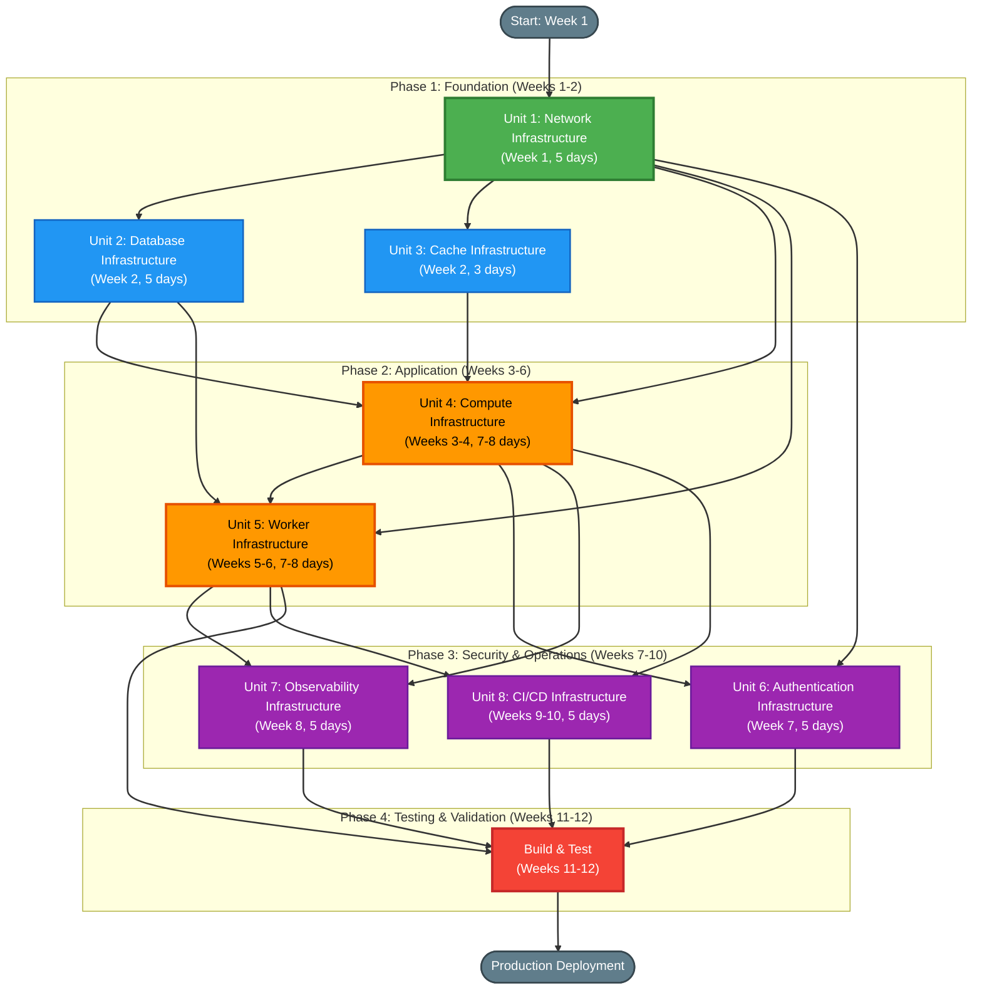

# Unit of Work Dependency Analysis

## Overview

This document provides a comprehensive dependency analysis of the 8 implementation units for the AWS modernization project. It defines the dependency relationships, deployment sequences, parallelization opportunities, and critical path analysis to guide efficient execution.

---

## Dependency Matrix

The following matrix shows which units depend on which other units. A checkmark (✓) indicates that the row unit **depends on** the column unit and must wait for it to complete.

| Unit | 1: Network | 2: Database | 3: Cache | 4: Compute | 5: Worker | 6: Auth | 7: Observability | 8: CI/CD |
|------|-----------|-------------|----------|------------|-----------|---------|-----------------|----------|
| **1: Network** | - | | | | | | | |
| **2: Database** | ✓ | - | | | | | | |
| **3: Cache** | ✓ | | - | | | | | |
| **4: Compute** | ✓ | ✓ | ✓ | - | | | | |
| **5: Worker** | ✓ | ✓ | | | - | | | |
| **6: Auth** | ✓ | | | | | - | | |
| **7: Observability** | | | | ✓ | ✓ | | - | |
| **8: CI/CD** | | | | ✓ | ✓ | | | - |

### Dependency Summary

**Unit 1: Network Infrastructure**
- **Depends on**: None
- **Depended on by**: Units 2, 3, 4, 5, 6
- **Type**: Foundation unit

**Unit 2: Database Infrastructure**
- **Depends on**: Unit 1 (VPC, private subnets, security groups)
- **Depended on by**: Units 4, 5
- **Type**: Data tier foundation

**Unit 3: Cache Infrastructure**
- **Depends on**: Unit 1 (VPC, private subnets, security groups)
- **Depended on by**: Unit 4
- **Type**: Data tier foundation

**Unit 4: Compute Infrastructure**
- **Depends on**: Units 1, 2, 3 (VPC, Aurora, ElastiCache)
- **Depended on by**: Units 7, 8
- **Type**: Application tier

**Unit 5: Worker Infrastructure**
- **Depends on**: Units 1, 2 (VPC, Aurora)
- **Depended on by**: Units 7, 8
- **Type**: Worker tier

**Unit 6: Authentication Infrastructure**
- **Depends on**: Unit 1 (VPC for Cognito integration)
- **Depended on by**: None (can be deployed after Unit 4 is functional)
- **Type**: Security enhancement

**Unit 7: Observability Infrastructure**
- **Depends on**: Units 4, 5 (ECS tasks, Lambda for metrics/logs)
- **Depended on by**: None
- **Type**: Operations enhancement

**Unit 8: CI/CD Infrastructure**
- **Depends on**: Units 4, 5 (ECS service, Lambda for deployment targets)
- **Depended on by**: None
- **Type**: Operations enhancement

---

## Deployment Sequence

The deployment sequence is organized into 4 phases over 12 weeks, with parallelization opportunities identified.

### Phase 1: Foundation (Weeks 1-2)

**Objective**: Establish networking, database, and cache infrastructure

**Sequence**:
```
Week 1:
  └─ Unit 1: Network Infrastructure (5 days)

Week 2:
  ├─ Unit 2: Database Infrastructure (5 days, parallel with Unit 3)
  └─ Unit 3: Cache Infrastructure (3 days, parallel with Unit 2)
```

**Dependencies**:
- Unit 1 completes first (no dependencies)
- Units 2 and 3 start after Unit 1 completes
- Units 2 and 3 execute in parallel (both depend only on Unit 1)

**Deliverables**:
- VPC with private subnets, VPC endpoints, security groups
- Aurora PostgreSQL cluster with migrated schema and data
- ElastiCache Serverless cluster

**Milestone**: Foundation infrastructure ready for application deployment

---

### Phase 2: Application (Weeks 3-6)

**Objective**: Deploy web application and background worker

**Sequence**:
```
Weeks 3-4:
  └─ Unit 4: Compute Infrastructure (7-8 days)

Weeks 5-6:
  └─ Unit 5: Worker Infrastructure (7-8 days)
```

**Dependencies**:
- Unit 4 starts after Units 1, 2, 3 complete
- Unit 5 starts after Unit 4 completes (newsletter publish endpoint needs to be updated before worker can process messages)

**Deliverables**:
- ECS Fargate service with ALB and auto-scaling
- SQS queue, Lambda function, SES configuration
- Application code updated for Aurora, ElastiCache, SQS integration

**Milestone**: Core application functionality operational (web tier + worker tier)

---

### Phase 3: Security & Operations (Weeks 7-10)

**Objective**: Enhance security, observability, and operational automation

**Sequence**:
```
Week 7:
  └─ Unit 6: Authentication Infrastructure (5 days, can start after Unit 4)

Week 8:
  └─ Unit 7: Observability Infrastructure (5 days, can start after Units 4 & 5)

Weeks 9-10:
  └─ Unit 8: CI/CD Infrastructure (5 days, can start after Units 4 & 5)
```

**Dependencies**:
- Unit 6 starts after Unit 4 completes (web application must be deployed)
- Unit 7 starts after Units 4 and 5 complete (requires ECS and Lambda for metrics)
- Unit 8 starts after Units 4 and 5 complete (requires ECS and Lambda for deployment targets)

**Parallelization Opportunity**:
- Units 6 and 7 can be developed in parallel if resources allow
- Both can start as soon as Unit 5 completes

**Deliverables**:
- Cognito User Pool with migrated admin users
- CloudWatch dashboards, alarms, X-Ray tracing
- GitHub Actions CI/CD pipeline with OIDC authentication

**Milestone**: Production-ready system with comprehensive security, monitoring, and automation

---

### Phase 4: Testing & Validation (Weeks 11-12)

**Objective**: Comprehensive testing and production deployment

**Sequence**:
```
Week 11:
  ├─ Integration testing across all units
  ├─ End-to-end testing (user journeys)
  ├─ Security testing (OWASP Top 10, vulnerability scanning)
  └─ Performance testing (load testing, latency validation)

Week 12:
  ├─ DR failover testing (cross-region)
  ├─ Production deployment
  └─ Post-deployment monitoring (24-hour watch)
```

**Dependencies**:
- All 8 units must be complete before Phase 4
- Testing can overlap with Unit 8 development in Week 10

**Deliverables**:
- Test reports (integration, security, performance, DR)
- Production deployment confirmation
- Monitoring dashboards showing healthy system state

**Milestone**: Production deployment complete, all quality gates passed

---

## Parallelization Opportunities

### Parallel Track 1: Units 2 & 3 (Week 2)
**Condition**: Both units depend only on Unit 1  
**Benefits**:
- Reduces foundation phase from 2 weeks + 5 days to 2 weeks
- Database and cache infrastructure ready simultaneously

**Resource Requirements**:
- 2 developers or 1 developer context-switching
- Separate CDK stacks can be developed independently

**Risk**: Minimal - both units are independent of each other

---

### Parallel Track 2: Units 6 & 7 (Weeks 7-8)
**Condition**: Unit 6 depends on Unit 4, Unit 7 depends on Units 4 & 5  
**Benefits**:
- Authentication and observability can be developed simultaneously
- Reduces Phase 3 from 4 weeks to 3 weeks if parallelized

**Resource Requirements**:
- 2 developers (auth team and observability team)
- Independent CDK stacks and application code changes

**Risk**: Low - both units are independent of each other

---

### Overlap: Testing & Final Unit (Weeks 10-11)
**Condition**: Unit 8 (CI/CD) can be finalized while integration testing begins  
**Benefits**:
- Reduces overall timeline by 1 week
- CI/CD pipeline can be used for final production deployment

**Resource Requirements**:
- CI/CD developer completes Unit 8 in Week 10
- QA team begins integration testing in Week 10

**Risk**: Low - testing does not depend on CI/CD infrastructure

---

## Critical Path Analysis

### Critical Path Sequence
```
Unit 1 → Unit 2 → Unit 4 → Unit 5 → Build & Test
```

**Total Critical Path Duration**: 1 week + 1 week + 1.5 weeks + 1.5 weeks + 2 weeks = **7 weeks**

**Critical Path Units**:
1. **Unit 1: Network Infrastructure** (1 week) - Foundation for all units
2. **Unit 2: Database Infrastructure** (1 week) - Required by Units 4 and 5
3. **Unit 4: Compute Infrastructure** (1.5 weeks) - Primary web application
4. **Unit 5: Worker Infrastructure** (1.5 weeks) - Background email delivery
5. **Build & Test** (2 weeks) - Final validation and production deployment

**Non-Critical Path Units** (can be delayed without affecting overall timeline):
- **Unit 3: Cache Infrastructure** - Can be delayed by 2 days without blocking Unit 4 (scheduled for 3 days, completes before Unit 2)
- **Unit 6: Authentication Infrastructure** - Not on critical path, can be deployed after core application
- **Unit 7: Observability Infrastructure** - Not on critical path, can be deployed after core application
- **Unit 8: CI/CD Infrastructure** - Not on critical path, can be deployed after core application

### Critical Path Buffer
**Total Project Duration**: 12 weeks  
**Critical Path Duration**: 7 weeks  
**Buffer**: 5 weeks

This buffer provides flexibility for:
- Delays in critical path units (e.g., database migration complexity)
- Parallel development of non-critical units (6, 7, 8)
- Comprehensive testing and validation (2 weeks allocated)
- Contingency for unforeseen issues

---

## Blocking Relationships

### Hard Blocks (Must Complete Before Next Unit Starts)

**Unit 1 → Units 2, 3, 4, 5, 6**
- **Reason**: VPC, subnets, and security groups must exist before deploying data and compute resources
- **Block Type**: Infrastructure dependency
- **Mitigation**: Prioritize Unit 1, ensure it completes on time (Week 1)

**Units 1, 2, 3 → Unit 4**
- **Reason**: Web application requires VPC, Aurora, and ElastiCache to function
- **Block Type**: Infrastructure + application dependency
- **Mitigation**: Ensure Units 2 and 3 complete by end of Week 2 before starting Unit 4 in Week 3

**Units 1, 2 → Unit 5**
- **Reason**: Lambda worker requires VPC and Aurora to process email delivery tasks
- **Block Type**: Infrastructure + application dependency
- **Mitigation**: Ensure Unit 2 completes before starting Unit 5 (Unit 4 also updates newsletter publish endpoint, which Unit 5 depends on)

**Unit 4 → Unit 5**
- **Reason**: Newsletter publish endpoint must be updated to write to SQS before Lambda worker can process messages
- **Block Type**: Application logic dependency
- **Mitigation**: Complete Unit 4 application changes (SQS write) before deploying Unit 5 Lambda

**Units 4, 5 → Units 7, 8**
- **Reason**: Observability and CI/CD require ECS and Lambda deployment targets to exist
- **Block Type**: Infrastructure dependency
- **Mitigation**: Ensure Units 4 and 5 complete before starting Units 7 and 8 in Weeks 7-10

### Soft Blocks (Recommended but Not Strictly Required)

**Unit 4 → Unit 6**
- **Reason**: Web application should be deployed and functional before migrating authentication to Cognito
- **Block Type**: Operational risk mitigation
- **Mitigation**: Deploy Unit 6 after Unit 4 is stable and tested

**Unit 8 → Production Deployment**
- **Reason**: CI/CD pipeline should be operational before production deployment for rollback capability
- **Block Type**: Operational best practice
- **Mitigation**: Complete Unit 8 before final production deployment in Week 12

---

## Dependency Diagram

The following Mermaid diagram visualizes unit dependencies and execution sequence:



### Diagram Legend
- **Green (U1)**: Foundation unit (critical path)
- **Blue (U2, U3)**: Data tier units (critical path for U2, parallel opportunity)
- **Orange (U4, U5)**: Application and worker tiers (critical path)
- **Purple (U6, U7, U8)**: Security and operations enhancements (non-critical path)
- **Red (BT)**: Testing and validation (critical path)
- **Gray**: Start and end milestones

---

## Parallel Execution Summary

### Week-by-Week Parallelization

**Week 1**:
- **Sequential**: Unit 1 (no parallelization possible)

**Week 2**:
- **Parallel**: Units 2 & 3 (both depend only on Unit 1)
- **Team Configuration**: 2 developers or 1 developer context-switching

**Weeks 3-4**:
- **Sequential**: Unit 4 (depends on Units 1, 2, 3)

**Weeks 5-6**:
- **Sequential**: Unit 5 (depends on Units 1, 2, 4)

**Weeks 7-8**:
- **Parallel**: Units 6 & 7 (Unit 6 depends on Unit 4, Unit 7 depends on Units 4 & 5)
- **Team Configuration**: 2 developers (auth team + observability team)

**Weeks 9-10**:
- **Overlapping**: Unit 8 (Week 9-10) + Integration Testing (Week 10-11)
- **Team Configuration**: CI/CD developer + QA team

**Weeks 11-12**:
- **Sequential**: Build & Test (all units complete)

### Optimal Team Configuration

**Scenario 1: Single Developer**
- **Timeline**: 12 weeks (no parallelization)
- **Approach**: Execute units sequentially, focus on critical path first

**Scenario 2: Two Developers**
- **Timeline**: 10 weeks (parallelization in Weeks 2 and 7-8)
- **Approach**: 
  - Week 2: Developer A (Unit 2), Developer B (Unit 3)
  - Weeks 7-8: Developer A (Unit 6), Developer B (Unit 7)

**Scenario 3: Three Developers**
- **Timeline**: 9 weeks (maximum parallelization)
- **Approach**:
  - Week 2: Dev A (Unit 2), Dev B (Unit 3), Dev C (documentation)
  - Weeks 7-8: Dev A (Unit 6), Dev B (Unit 7), Dev C (Unit 8 start)
  - Week 9-10: Dev A & B (testing), Dev C (Unit 8 finalization)

---

## Risk Assessment by Dependency

### High-Risk Dependencies (Critical Path)

**Risk 1: Unit 1 Delays Block All Subsequent Units**
- **Impact**: HIGH - Entire project blocked if Unit 1 delayed
- **Mitigation**: 
  - Prioritize Unit 1 completion in Week 1
  - Use proven VPC patterns from AWS CDK examples
  - Test VPC endpoint connectivity early

**Risk 2: Database Migration (Unit 2) Complexity**
- **Impact**: MEDIUM - Manual schema creation and data migration error-prone
- **Mitigation**:
  - Automate schema creation with SQL scripts
  - Validate data integrity with checksums and row counts
  - Test migration in staging environment first

**Risk 3: Unit 4 Application Integration Issues**
- **Impact**: MEDIUM - ECS deployment may fail due to configuration errors
- **Mitigation**:
  - Test Dockerfile locally before pushing to ECR
  - Validate Secrets Manager integration in development
  - Use ECS task definition linting (CDK validation)

### Medium-Risk Dependencies (Non-Critical Path)

**Risk 4: Cognito Integration (Unit 6) Complexity**
- **Impact**: LOW - Authentication modernization not blocking core functionality
- **Mitigation**:
  - Test Cognito JWT validation thoroughly in staging
  - Preserve local auth as fallback during migration
  - Migrate admin users in batches

**Risk 5: Observability (Unit 7) Dashboard Configuration**
- **Impact**: LOW - Observability enhances operations but not blocking deployment
- **Mitigation**:
  - Use CloudFormation-based dashboard definitions (infrastructure as code)
  - Test alarms with simulated failure scenarios

---

## Execution Recommendations

### Recommendation 1: Follow Critical Path Strictly
**Rationale**: Critical path units (1, 2, 4, 5) must complete on time to meet 12-week deadline  
**Action**: Allocate best resources to critical path units, minimize context switching

### Recommendation 2: Exploit Parallelization in Weeks 2 and 7-8
**Rationale**: Parallel execution reduces overall timeline by 1-2 weeks  
**Action**: If 2+ developers available, parallelize Units 2 & 3, and Units 6 & 7

### Recommendation 3: Start Testing Early (Week 10)
**Rationale**: Testing can overlap with Unit 8 development  
**Action**: QA team begins integration testing in Week 10 while CI/CD is finalized

### Recommendation 4: Prioritize Unit 1 Completion (Week 1)
**Rationale**: Unit 1 blocks all subsequent units  
**Action**: Dedicate full focus to Unit 1, avoid scope creep, use proven VPC patterns

### Recommendation 5: Validate Database Migration Early (Week 2)
**Rationale**: Manual migration is error-prone and blocks Units 4 and 5  
**Action**: Test schema creation and data import in staging, validate SQLx query compatibility

---

## Contingency Planning

### Scenario 1: Unit 1 Delayed by 1 Week
**Impact**: All units shift by 1 week, project extends to 13 weeks  
**Mitigation**: 
- Reduce testing phase from 2 weeks to 1 week (risky)
- Request timeline extension from stakeholders

### Scenario 2: Database Migration (Unit 2) Takes 2 Weeks Instead of 1
**Impact**: Critical path extended by 1 week, project extends to 13 weeks  
**Mitigation**:
- Parallelize Unit 6 and Unit 7 to recover 1 week
- Reduce Unit 8 scope (deploy CI/CD after production launch)

### Scenario 3: Unit 4 ECS Deployment Issues
**Impact**: Unit 5 blocked, critical path extended  
**Mitigation**:
- Test Dockerfile and ECS task definition locally before deployment
- Use AWS support for troubleshooting if deployment fails
- Consider deploying minimal ECS service first, then iterate

### Scenario 4: Resource Constraints (Single Developer)
**Impact**: No parallelization possible, full 12 weeks required  
**Mitigation**:
- Accept 12-week timeline with no buffer
- Prioritize critical path units over nice-to-have enhancements (Units 6, 7, 8)

---

## Success Metrics

### Dependency Management Success Criteria
- [ ] Unit 1 completes on time (Week 1)
- [ ] Units 2 and 3 leverage parallelization (Week 2)
- [ ] Critical path units (1, 2, 4, 5) complete within 6 weeks
- [ ] Non-critical units (6, 7, 8) complete within buffer period (Weeks 7-10)
- [ ] All blocking dependencies resolved before next unit starts
- [ ] No unit blocked for more than 1 day due to dependency issues

### Timeline Success Criteria
- [ ] Phase 1 (Foundation) completes by end of Week 2
- [ ] Phase 2 (Application) completes by end of Week 6
- [ ] Phase 3 (Security & Operations) completes by end of Week 10
- [ ] Phase 4 (Testing & Validation) completes by end of Week 12
- [ ] Production deployment occurs in Week 12

---

**Document Version**: 1.0  
**Last Updated**: 2026-06-12  
**Status**: Ready for Review
