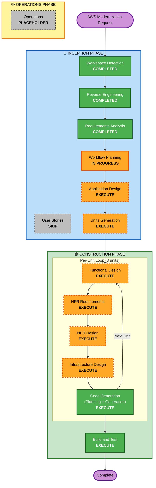

# Execution Plan - AWS Modernization

## Detailed Analysis Summary

### Transformation Scope (Brownfield)
- **Transformation Type**: Architectural + Infrastructure Transformation
- **Primary Changes**: 
  - Migrate from monolithic local deployment to cloud-native AWS architecture
  - Replace polling background worker with event-driven SQS + Lambda
  - Migrate database from self-hosted PostgreSQL to Aurora Serverless v2
  - Migrate session store from external Redis to ElastiCache Serverless
  - Replace Postmark with Amazon SES
  - Migrate authentication from local passwords to AWS Cognito
  - Implement private networking with VPC endpoints
  - Add comprehensive observability with CloudWatch + X-Ray
  
- **Related Components**:
  - **Infrastructure (NEW)**: VPC, subnets, security groups, VPC endpoints, ALB, ECS Fargate, Lambda, SQS, Aurora, ElastiCache, Secrets Manager, Cognito, CloudWatch, X-Ray
  - **Application Code**: Configuration module, startup module, email client, authentication module, routes module, background worker module
  - **Database**: Schema migration to Aurora, connection string updates
  - **CI/CD (NEW)**: GitHub Actions workflow, AWS CDK Python stacks
  - **Observability (NEW)**: CloudWatch dashboards, alarms, X-Ray instrumentation

### Change Impact Assessment

**User-facing changes**: YES
- Admin users must migrate to AWS Cognito authentication (password reset required)
- No downtime expected for public users (gradual migration)
- Improved reliability (99.9% availability vs current unknown)
- Improved performance (< 200ms API latency target)

**Structural changes**: YES - MAJOR
- Monolithic architecture split into:
  - Web tier: ECS Fargate containers
  - Worker tier: SQS + Lambda event-driven
  - Data tier: Aurora PostgreSQL + ElastiCache Serverless
  - Auth tier: AWS Cognito User Pools
- Background worker removed (replaced by Lambda functions)
- Session management updated (Redis → ElastiCache)

**Data model changes**: MINIMAL
- Database schema preserved (6 tables remain)
- issue_delivery_queue table deprecated (replaced by SQS)
- users table deprecated for authentication (Cognito used instead, table kept for audit)
- All data migrated with zero loss

**API changes**: MINIMAL
- Public API endpoints unchanged (same paths, same contracts)
- Admin API endpoints unchanged (same paths, auth mechanism updated internally)
- Login endpoint updated to authenticate via Cognito instead of local database

**NFR impact**: YES - SIGNIFICANT
- **Reliability**: 99.9% availability (Multi-AZ), Warm Standby DR
- **Security**: Private subnets, VPC endpoints, Secrets Manager, encryption at rest/transit
- **Performance**: < 200ms API latency, email queuing < 1 minute
- **Scalability**: Auto-scaling web tier, serverless worker, serverless database
- **Observability**: CloudWatch metrics/logs/alarms, X-Ray distributed tracing
- **Operability**: Infrastructure as Code (AWS CDK), CI/CD (GitHub Actions)

### Component Relationships (Brownfield)

**Primary Component**: zero2prod web application (Rust/Actix-web)

**Infrastructure Components (NEW)**:
- **Network Stack**: VPC, subnets, VPC endpoints, security groups
  - Change Type: Major (new infrastructure)
  - Change Reason: Private networking requirement (NFR-3)
  - Change Priority: Critical

- **Database Stack**: Aurora PostgreSQL Serverless v2
  - Change Type: Major (migration)
  - Change Reason: Replace self-hosted PostgreSQL
  - Change Priority: Critical

- **Cache Stack**: ElastiCache Serverless for Redis
  - Change Type: Major (migration)
  - Change Reason: Replace external Redis
  - Change Priority: Critical

- **Compute Stack**: ECS Fargate, ALB, ECR
  - Change Type: Major (new infrastructure)
  - Change Reason: Deploy web application to AWS
  - Change Priority: Critical

- **Worker Stack**: SQS, Lambda, SES
  - Change Type: Major (architectural change)
  - Change Reason: Replace polling worker with event-driven
  - Change Priority: Critical

- **Auth Stack**: Cognito User Pools
  - Change Type: Major (new service)
  - Change Reason: Modernize authentication (FR-6)
  - Change Priority: Important

- **Observability Stack**: CloudWatch, X-Ray, SNS
  - Change Type: Major (new infrastructure)
  - Change Reason: Comprehensive observability (NFR-7, NFR-8)
  - Change Priority: Important

- **CI/CD Stack**: GitHub Actions, ECR
  - Change Type: Major (new automation)
  - Change Reason: Deployment automation (NFR-13)
  - Change Priority: Important

**Application Code Components (MODIFIED)**:
- **configuration.rs**: Update to load from Secrets Manager
  - Change Type: Minor
  - Change Reason: Secrets management (NFR-4)
  - Change Priority: Critical

- **startup.rs**: Update to configure Cognito authentication
  - Change Type: Minor
  - Change Reason: Cognito integration (FR-6)
  - Change Priority: Important

- **email_client.rs**: Replace Postmark with SES
  - Change Type: Minor
  - Change Reason: SES migration (FR-5)
  - Change Priority: Important

- **authentication/**: Update to validate Cognito JWTs
  - Change Type: Moderate
  - Change Reason: Cognito integration (FR-6)
  - Change Priority: Important

- **routes/admin/newsletter/post.rs**: Write to SQS instead of database queue
  - Change Type: Moderate
  - Change Reason: Event-driven worker (FR-2)
  - Change Priority: Critical

- **issue_delivery_worker.rs**: REMOVED, replaced by Lambda function
  - Change Type: Major
  - Change Reason: Event-driven worker (FR-2)
  - Change Priority: Critical

**Dependent Components**: None (zero2prod is end-user facing, no downstream consumers)

**Supporting Components**:
- **Monitoring**: CloudWatch dashboards, alarms (NEW)
- **Logging**: CloudWatch Logs, X-Ray traces (NEW)
- **Deployment**: GitHub Actions, AWS CDK (NEW)

### Risk Assessment

**Risk Level**: HIGH
- System-wide architectural transformation
- Multiple new AWS services (17 services)
- Database migration with manual schema creation
- Authentication mechanism change (Cognito)
- Background worker paradigm shift (polling → event-driven)

**Rollback Complexity**: MODERATE-TO-DIFFICULT
- **Easy**: ECS task rollback (previous task definition)
- **Easy**: Lambda rollback (previous version)
- **Moderate**: Aurora rollback (restore from snapshot, minutes of data loss)
- **Moderate**: Cognito rollback (revert to local auth, re-deploy code)
- **Difficult**: Multi-stack infrastructure rollback (requires coordinated CDK rollback)
- **Mitigation**: Phased migration with staging environment testing

**Testing Complexity**: COMPLEX
- Integration testing across multiple AWS services
- End-to-end testing (ALB → ECS → Aurora → SQS → Lambda → SES)
- Security testing (VPC endpoints, encryption, IAM roles)
- Performance testing (< 200ms latency target)
- DR testing (cross-region failover)
- Load testing (auto-scaling validation)

---

## Workflow Visualization

---

## Phases to Execute

### 🔵 INCEPTION PHASE
- [x] **Workspace Detection** (COMPLETED)
  - Analyzed brownfield zero2prod Rust application
  - Identified monolithic architecture with background worker

- [x] **Reverse Engineering** (COMPLETED)
  - Comprehensive analysis of existing system (10 artifacts, 36 source files)
  - Architecture, code structure, API documentation, component inventory
  - AWS readiness: Grade A-

- [x] **Requirements Analysis** (COMPLETED)
  - 10 functional requirements, 15 non-functional requirements
  - AWS service selection, Well-Architected Framework alignment
  - Extensions: Security Baseline (enabled), PBT (partial)

- [x] **User Stories** (SKIP)
  - **Rationale**: This is an infrastructure migration and modernization project with well-defined technical requirements. The primary stakeholders are the development/operations team, not end users. User stories add limited value for infrastructure transformations where requirements are already comprehensive (10 FR + 15 NFR). The existing API contracts are preserved, minimizing user-facing changes.

- [ ] **Workflow Planning** (IN PROGRESS)
  - Creating comprehensive execution plan
  - Determining stage execution strategy

- [ ] **Application Design** - EXECUTE
  - **Rationale**: CRITICAL - Major architectural transformation requiring high-level component design
    - New AWS infrastructure components need definition (8 CDK stacks)
    - Application components require redesign for cloud-native patterns (SQS integration, Cognito auth, SES client)
    - Service layer needs clear contracts between ECS, Lambda, Aurora, ElastiCache, Cognito
    - Component dependencies must be clarified (which CDK stacks depend on others)
    - API contracts between application and AWS services need specification
  - **Output**: High-level component diagram, service layer definitions, AWS service integration points

- [ ] **Units Generation** - EXECUTE
  - **Rationale**: CRITICAL - Complex multi-component system requiring decomposition into manageable units
    - 8 distinct infrastructure units (Network, Database, Cache, Compute, Worker, Auth, Observability, CI/CD)
    - Each unit has different dependencies and can be developed/tested independently
    - Clear unit boundaries enable parallel development (multiple units can progress simultaneously)
    - Phased migration strategy (12 weeks) requires organized unit breakdown
    - Each unit maps to a CDK stack with explicit dependencies
  - **Output**: 8 implementation units with dependency graph, execution sequence, per-unit scope

### 🟢 CONSTRUCTION PHASE

**Per-Unit Design Stages** (Execute for EACH of 8 units):

- [ ] **Functional Design** - EXECUTE (per unit)
  - **Rationale**: CRITICAL - Each unit has distinct business logic and functional requirements
    - **Infrastructure Units**: CDK constructs, resource configurations, IAM policies, security groups
    - **Application Units**: Code changes for AWS service integration (SQS write, Cognito auth, SES send)
    - **Lambda Unit**: Email delivery business logic, error handling, retry strategies
    - Complex logic needs detailed design before implementation
  - **Output** (per unit): Functional specifications, business rules, data models, validation logic

- [ ] **NFR Requirements** - EXECUTE (per unit)
  - **Rationale**: CRITICAL - Each unit has specific non-functional requirements
    - **Network Unit**: Private subnets, VPC endpoints, security groups (SECURITY-01, SECURITY-02)
    - **Database Unit**: Encryption, Multi-AZ, backup retention (NFR-1, NFR-2)
    - **Compute Unit**: Auto-scaling, performance targets (< 200ms), health checks (NFR-9, NFR-11)
    - **Worker Unit**: Lambda concurrency, SQS batch size, SES quotas (NFR-10)
    - **Auth Unit**: Cognito password policies, MFA configuration (NFR-3)
    - **Observability Unit**: CloudWatch metrics, X-Ray sampling, alarm thresholds (NFR-7, NFR-8)
  - **Output** (per unit): Performance targets, security requirements, scalability constraints, tech stack selection

- [ ] **NFR Design** - EXECUTE (per unit)
  - **Rationale**: CRITICAL - NFR requirements demand specific implementation patterns
    - **Security patterns**: VPC endpoints instead of NAT Gateway, private subnets, Secrets Manager integration
    - **Reliability patterns**: Multi-AZ deployment, health checks, graceful degradation
    - **Performance patterns**: Connection pooling, caching strategies, Aurora ACU scaling
    - **Observability patterns**: Structured logging, X-Ray instrumentation, metric exports
  - **Output** (per unit): NFR implementation strategies, AWS service configurations, optimization techniques

- [ ] **Infrastructure Design** - EXECUTE (per unit)
  - **Rationale**: CRITICAL - All units require AWS infrastructure design
    - **CDK Stack Design**: Resources, dependencies, outputs, cross-stack references
    - **AWS Service Configuration**: Aurora parameter groups, ElastiCache config, ECS task definitions, Lambda env vars
    - **Networking**: Security groups, subnets, VPC endpoints, ALB target groups
    - **IAM**: Task roles, execution roles, resource policies, least privilege
    - **Deployment**: CDK app structure, stack dependencies, deployment order
  - **Output** (per unit): AWS CDK Python code structure, resource specifications, IAM policies, deployment sequence

- [ ] **Code Generation (Planning + Generation)** - EXECUTE (per unit, ALWAYS)
  - **Rationale**: ALWAYS EXECUTES - Implementation required for all units
    - **Part 1 - Planning**: Detailed code generation plan with explicit steps per unit
    - **Part 2 - Generation**: Execute plan to generate CDK code, application code, Lambda functions, GitHub Actions
  - **Output** (per unit): AWS CDK stacks, modified application code, Lambda handlers, configuration files, CI/CD workflows

- [ ] **Build and Test** - EXECUTE (ALWAYS)
  - **Rationale**: ALWAYS EXECUTES - Comprehensive testing across all units
    - Unit tests for application code and Lambda functions
    - Integration tests across AWS services (ECS → Aurora, Lambda → SES)
    - Infrastructure tests (CDK synth, CloudFormation validation)
    - End-to-end tests (full user journeys)
    - Security tests (OWASP Top 10, encryption verification)
    - Performance tests (< 200ms latency, load testing)
    - DR tests (cross-region failover)
  - **Output**: Build instructions, test suites, test execution results, test coverage report

### 🟡 OPERATIONS PHASE
- [ ] **Operations** - PLACEHOLDER
  - **Rationale**: Future expansion for deployment automation, monitoring runbooks, incident response procedures

---

## Units of Work (Implementation Units)

### Unit 1: Network Infrastructure (CDK)
**Dependencies**: None (foundation unit)
**Scope**:
- VPC with public and private subnets across 2 AZs
- VPC endpoints (S3 Gateway, ECR, Logs, Secrets Manager, STS, SES, SQS)
- Security groups (ALB, ECS, Aurora, ElastiCache, Lambda)
- Network ACLs (optional)

**AWS Services**: VPC, VPC Endpoints, Security Groups
**Priority**: CRITICAL (all other units depend on networking)
**Estimated Effort**: 1 week

---

### Unit 2: Database Infrastructure (CDK + Migration)
**Dependencies**: Unit 1 (Network)
**Scope**:
- Aurora PostgreSQL Serverless v2 cluster
- Multi-AZ deployment configuration
- Parameter groups (PostgreSQL settings)
- Secrets Manager secret for database password
- Manual database schema creation (6 tables)
- Data migration from source PostgreSQL

**AWS Services**: Aurora PostgreSQL Serverless v2, Secrets Manager
**Priority**: CRITICAL (application and worker depend on database)
**Estimated Effort**: 1 week

---

### Unit 3: Cache Infrastructure (CDK)
**Dependencies**: Unit 1 (Network)
**Scope**:
- ElastiCache Serverless for Redis cluster
- Multi-AZ replication
- Secrets Manager secret for connection string
- Application configuration update (redis_uri)

**AWS Services**: ElastiCache Serverless, Secrets Manager
**Priority**: CRITICAL (web application depends on session store)
**Estimated Effort**: 3 days

---

### Unit 4: Compute Infrastructure (CDK + Application)
**Dependencies**: Unit 1 (Network), Unit 2 (Database), Unit 3 (Cache)
**Scope**:
- Application Load Balancer
- ECS Fargate cluster and service
- ECS task definition (zero2prod container)
- ECR repository for Docker images
- IAM roles (task role, execution role)
- CloudWatch log group
- Dockerfile for Rust application
- Application code updates:
  - Configuration to load from Secrets Manager
  - Connection to Aurora and ElastiCache
  - Health check endpoint validation

**AWS Services**: ECS Fargate, ALB, ECR, IAM, CloudWatch Logs
**Priority**: CRITICAL (primary web application)
**Estimated Effort**: 1.5 weeks

---

### Unit 5: Worker Infrastructure (CDK + Lambda + Application)
**Dependencies**: Unit 1 (Network), Unit 2 (Database)
**Scope**:
- SQS queue for email delivery tasks
- SQS Dead Letter Queue for failed messages
- Lambda function for email sending
- Lambda IAM execution role
- SES configuration (sender identity, production access)
- Application code updates:
  - Newsletter publish endpoint writes to SQS
  - Remove issue_delivery_worker.rs
  - Remove issue_delivery_queue table (deprecated)
- Lambda handler code:
  - Retrieve newsletter content from Aurora
  - Send email via SES
  - Error handling and logging

**AWS Services**: SQS, Lambda, SES, IAM
**Priority**: CRITICAL (newsletter delivery functionality)
**Estimated Effort**: 1.5 weeks

---

### Unit 6: Authentication Infrastructure (CDK + Application)
**Dependencies**: Unit 1 (Network)
**Scope**:
- Cognito User Pool
- Cognito User Pool Client
- User migration (username only, password reset)
- Application code updates:
  - Login endpoint authenticates via Cognito
  - Session middleware validates Cognito JWT
  - Remove password hashing logic (Argon2 replaced by Cognito)
  - Update authentication middleware
- Admin user migration procedure

**AWS Services**: Cognito User Pools, IAM
**Priority**: IMPORTANT (can migrate after web tier is working)
**Estimated Effort**: 1 week

---

### Unit 7: Observability Infrastructure (CDK)
**Dependencies**: Unit 4 (Compute), Unit 5 (Worker)
**Scope**:
- CloudWatch dashboards (operational, business, infrastructure)
- CloudWatch alarms (service down, high error rate, Lambda errors, SQS DLQ)
- SNS topic for alerts
- X-Ray tracing configuration (ECS and Lambda)
- Application code updates:
  - X-Ray middleware integration (optional enhancement)
- ALB access logging to S3

**AWS Services**: CloudWatch, X-Ray, SNS, S3
**Priority**: IMPORTANT (observability post-deployment)
**Estimated Effort**: 1 week

---

### Unit 8: CI/CD Infrastructure (GitHub Actions + CDK)
**Dependencies**: Unit 4 (Compute), Unit 5 (Worker)
**Scope**:
- GitHub Actions workflow (.github/workflows/deploy.yml)
- AWS OIDC provider for GitHub Actions
- IAM role for GitHub Actions
- Build stage (compile Rust, run tests)
- Package stage (Docker build, push to ECR)
- Deploy stage (CDK deploy, ECS update, Lambda deploy)
- Smoke tests stage
- Environment configuration (dev, staging, production)

**AWS Services**: IAM (OIDC), ECR (already in Unit 4)
**Priority**: IMPORTANT (deployment automation)
**Estimated Effort**: 1 week

---

## Unit Execution Sequence

### Phase 1: Foundation (Weeks 1-2)
1. **Unit 1: Network Infrastructure** - Parallel with Unit 2/3 preparation
2. **Unit 2: Database Infrastructure** - After Unit 1 networking
3. **Unit 3: Cache Infrastructure** - After Unit 1 networking

### Phase 2: Application (Weeks 3-6)
4. **Unit 4: Compute Infrastructure** - After Units 1, 2, 3
5. **Unit 5: Worker Infrastructure** - After Units 1, 2, 4

### Phase 3: Security & Operations (Weeks 7-10)
6. **Unit 6: Authentication Infrastructure** - After Unit 4
7. **Unit 7: Observability Infrastructure** - After Units 4, 5
8. **Unit 8: CI/CD Infrastructure** - After Units 4, 5

### Phase 4: Testing & Validation (Weeks 11-12)
- Integration testing across all units
- End-to-end testing
- Security testing
- Performance testing
- DR testing
- Production deployment

**Parallelization Opportunities**:
- Units 2 and 3 can be developed in parallel after Unit 1
- Units 6 and 7 can be developed in parallel after Unit 4
- Testing can overlap with final unit development

---

## Estimated Timeline

**Total Stages to Execute**: 8 units × 5 stages per unit = 40 stage executions + 3 INCEPTION stages + 1 BUILD & TEST = 44 total stages

**Estimated Duration**: 12 weeks (as specified in requirements)
- Weeks 1-2: INCEPTION (Workspace Detection, Reverse Engineering, Requirements Analysis, Workflow Planning, Application Design, Units Generation)
- Weeks 3-10: CONSTRUCTION (Per-unit design and code generation for 8 units)
- Weeks 11-12: BUILD & TEST (Integration testing, deployment, validation)

**Key Milestones**:
- Week 2: Infrastructure design complete, CDK project initialized
- Week 4: Network, Database, Cache units complete (foundation ready)
- Week 6: Web application deployed to ECS Fargate
- Week 8: Background worker migrated to SQS + Lambda
- Week 10: Cognito authentication, observability, CI/CD complete
- Week 12: Production deployment, all tests passing

---

## Success Criteria

### Primary Goal
Modernize zero2prod newsletter service to AWS cloud-native architecture following Well-Architected Framework principles, achieving 99.9% availability, comprehensive security, and operational excellence.

### Key Deliverables
1. **Infrastructure as Code**: 8 AWS CDK Python stacks fully deployed
2. **Web Application**: ECS Fargate deployment with < 200ms API latency
3. **Background Worker**: SQS + Lambda event-driven email delivery
4. **Database**: Aurora PostgreSQL with zero data loss migration
5. **Authentication**: Cognito User Pools for admin users
6. **Observability**: CloudWatch + X-Ray with critical alerting
7. **CI/CD**: GitHub Actions automated deployment pipeline
8. **Security**: Private networking, encryption, Secrets Manager (SECURITY-01, SECURITY-02 compliant)
9. **Documentation**: Architecture diagrams, runbooks, deployment guides

### Quality Gates
1. **Security**: All SECURITY extension rules verified as compliant
2. **Testing**: > 80% integration test coverage, all critical paths tested
3. **Performance**: API latency < 200ms (p95), load testing passed
4. **Reliability**: 99.9% availability achieved, DR failover tested
5. **Code Quality**: No blocking PBT findings (PBT-02, 03, 07, 08, 09)
6. **Operational Readiness**: CloudWatch dashboards, alarms, runbooks complete
7. **Integration**: All AWS services integrated and tested end-to-end
8. **Compliance**: Well-Architected Framework review passed

---

## Risk Mitigation Strategies

### Risk 1: Aurora PostgreSQL Compatibility
**Mitigation**: Test all SQLx queries in staging environment, validate compile-time checks

### Risk 2: Lambda Cold Start Impact
**Mitigation**: Provision 1-2 instances for warm starts, monitor latency metrics

### Risk 3: Cognito JWT Integration Complexity
**Mitigation**: Implement in staging first, comprehensive integration tests

### Risk 4: SES Sending Limits
**Mitigation**: Request production access early (Week 1), monitor quotas

### Risk 5: VPC Endpoint Configuration
**Mitigation**: Document all endpoints required, test connectivity from private subnets

### Risk 6: Multi-Stack CDK Dependencies
**Mitigation**: Explicit stack dependencies in CDK code, deployment order documented

### Risk 7: Timeline Pressure (12 weeks)
**Mitigation**: Phased approach with MVP first (ECS + Aurora), then advanced features

---

**Document Version**: 1.0  
**Last Updated**: 2026-06-11  
**Status**: Ready for Approval
