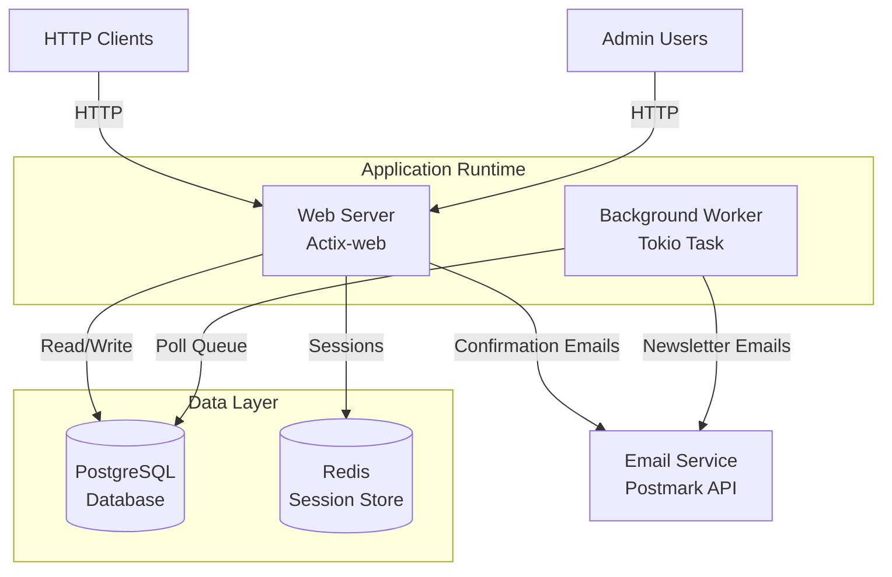
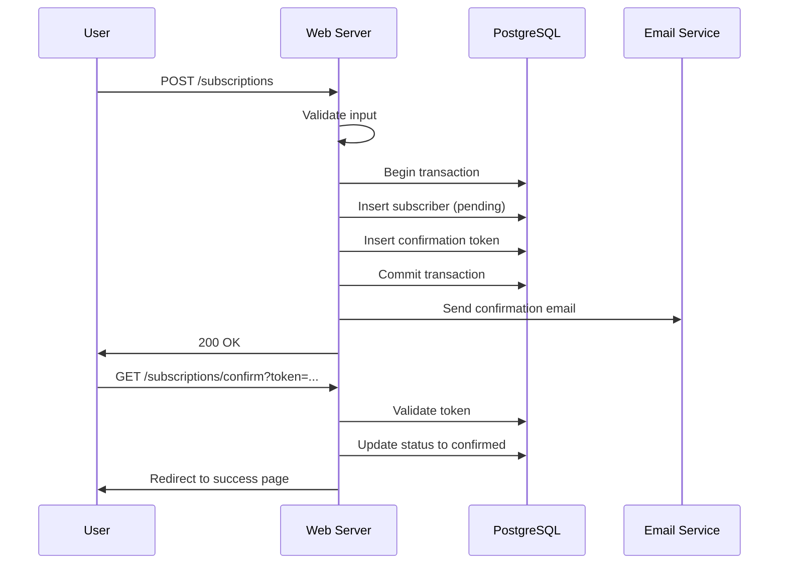
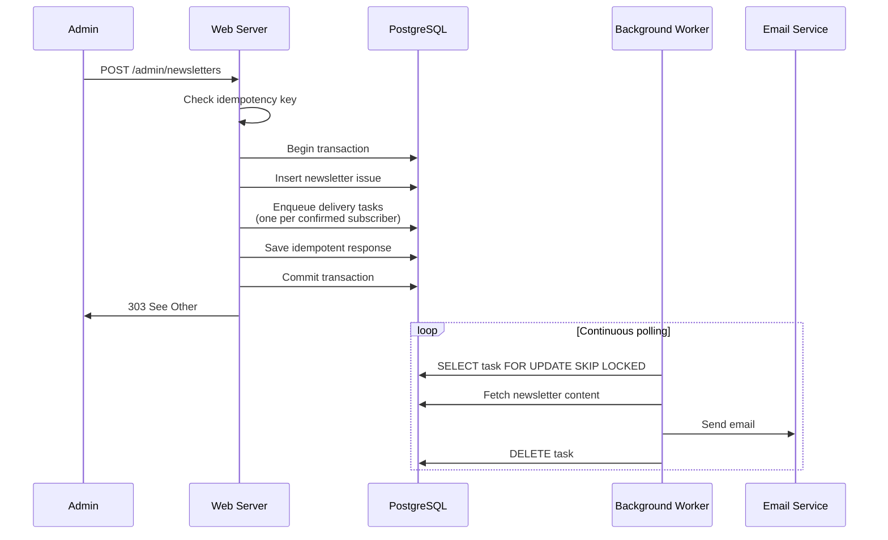

# Architecture Documentation

## System Architecture Overview

Zero2prod is a monolithic Rust application with two concurrent runtime components: a web server and a background worker. Both components share the same database and configuration but operate independently.

## High-Level Architecture

## Component Architecture

### 1. Web Server Component

**Technology**: Actix-web HTTP server with Tokio async runtime

**Responsibilities**:
- HTTP request handling and routing
- Authentication and authorization
- Session management (Redis-backed)
- Database transactions
- Email confirmation flow
- Newsletter submission and idempotency

**Key Features**:
- Middleware pipeline: TracingLogger → FlashMessages → SessionMiddleware → Auth Middleware
- Cookie-based sessions with Redis storage
- Protected admin routes with authentication middleware
- Idempotent newsletter publishing

### 2. Background Worker Component

**Technology**: Tokio async task with continuous polling loop

**Responsibilities**:
- Poll delivery queue for pending tasks
- Retrieve newsletter content
- Send emails to confirmed subscribers
- Handle failures gracefully
- Delete completed tasks

**Key Features**:
- Uses PostgreSQL `FOR UPDATE SKIP LOCKED` for concurrent worker safety
- 10-second sleep on empty queue
- 1-second backoff on errors
- Continues processing after individual email failures

### 3. Domain Layer

**Purpose**: Type-safe domain modeling with validation

**Components**:
- `SubscriberEmail`: Validates email format and provides type safety
- `SubscriberName`: Validates name constraints (length, forbidden characters)
- `NewSubscriber`: Aggregates validated email and name

### 4. Authentication Module

**Components**:
- **Password Management**: Argon2 hashing and verification
- **Middleware**: `reject_anonymous_users` for protecting admin routes
- **Session Integration**: Validates user_id from session state

### 5. Idempotency Module

**Purpose**: Prevents duplicate newsletter submissions

**Components**:
- `IdempotencyKey`: Type-safe wrapper for client-supplied keys
- `try_processing`: Checks for existing processing and returns saved response
- `save_response`: Persists response after successful processing

**Database State**:
- Tracks `user_id`, `idempotency_key`, `response_status_code`, `response_headers`, `response_body`
- Created timestamp for auditing

### 6. Email Client

**Purpose**: Integration with Postmark email service API

**Features**:
- HTTP client with configurable timeout
- Authentication via `X-Postmark-Server-Token` header
- Sends both HTML and text email bodies

## Data Flow

### Subscription Flow

### Newsletter Publishing Flow

## Integration Points

### External Dependencies

| Service | Purpose | Protocol | Configuration |
|---------|---------|----------|---------------|
| PostgreSQL | Primary data store | TCP (PostgreSQL wire protocol) | Host, port, credentials, SSL mode |
| Redis | Session storage | TCP (RESP protocol) | Connection URI |
| Postmark API | Email delivery | HTTPS REST | Base URL, authorization token, timeout |

### Configuration Management

- **Layered configuration**: Base YAML + environment-specific YAML + environment variables
- **Environment variable prefix**: `APP_`
- **Separator**: `__` (double underscore) for nested keys
- **Secret management**: Uses `secrecy` crate to prevent accidental logging

### Database Schema

**Tables**:
1. `subscriptions`: id, email, name, subscribed_at, status
2. `subscription_tokens`: subscription_token, subscriber_id
3. `users`: user_id, username, password_hash
4. `newsletter_issues`: newsletter_issue_id, title, text_content, html_content, published_at
5. `issue_delivery_queue`: newsletter_issue_id, subscriber_email
6. `idempotency`: user_id, idempotency_key, response_status_code, response_headers, response_body, created_at

## Deployment Architecture

### Runtime Model

- **Single process, dual tasks**: Main function spawns both web server and background worker as separate Tokio tasks
- **Graceful shutdown**: Uses `tokio::select!` to monitor both tasks and report exits
- **Shared configuration**: Both tasks load from same configuration source

### Scalability Considerations

**Current Limitations**:
- Web server binds to single port (cannot horizontally scale without load balancer)
- Background worker uses single polling loop (cannot run multiple workers safely due to FOR UPDATE SKIP LOCKED limit)
- Session affinity not required (Redis-backed sessions)

**AWS Modernization Opportunities**:
- Replace monolithic worker with SQS + Lambda for elastic scaling
- Replace Redis sessions with DynamoDB or ElastiCache
- Use RDS for PostgreSQL with read replicas
- Deploy web tier on ECS/Fargate with ALB for horizontal scaling
- Use SES instead of Postmark for email delivery

## Security Architecture

### Authentication & Authorization

- **Password Storage**: Argon2id with secure defaults
- **Session Management**: Server-side sessions in Redis with HTTP-only cookies
- **HMAC Secret**: Used for cookie signing and flash message integrity
- **Middleware Protection**: Admin routes wrapped with `reject_anonymous_users` middleware

### Data Protection

- **Secrets Management**: Secrecy crate prevents accidental secret exposure in logs
- **SQL Injection**: SQLx compile-time checked queries prevent SQL injection
- **Password Validation**: Enforced minimum complexity via validation rules

## Observability

### Logging & Tracing

- **Framework**: `tracing` with `tracing-subscriber`
- **Formatters**: Bunyan JSON formatter for structured logging
- **HTTP Tracing**: `tracing-actix-web` middleware for request tracing
- **Distributed Tracing**: Span propagation across async boundaries

### Instrumentation

- Tracing spans on all major operations
- Error context with `anyhow` for error chain tracking
- Structured fields for subscriber email, newsletter issue ID, user ID

## Technology Stack Summary

| Layer | Technology | Version |
|-------|-----------|---------|
| Language | Rust | 2024 edition |
| Web Framework | Actix-web | 4.x |
| Async Runtime | Tokio | 1.x |
| Database | PostgreSQL | N/A (via SQLx 0.8) |
| Session Store | Redis | N/A (via actix-session 0.11) |
| ORM/Query | SQLx | 0.8 |
| Observability | tracing + tracing-subscriber | 0.1.x / 0.3.x |
| Configuration | config crate | 0.15 |
| Email Client | reqwest | 0.12 |
