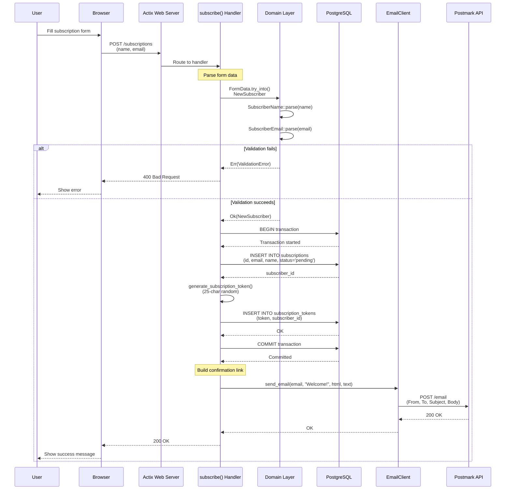
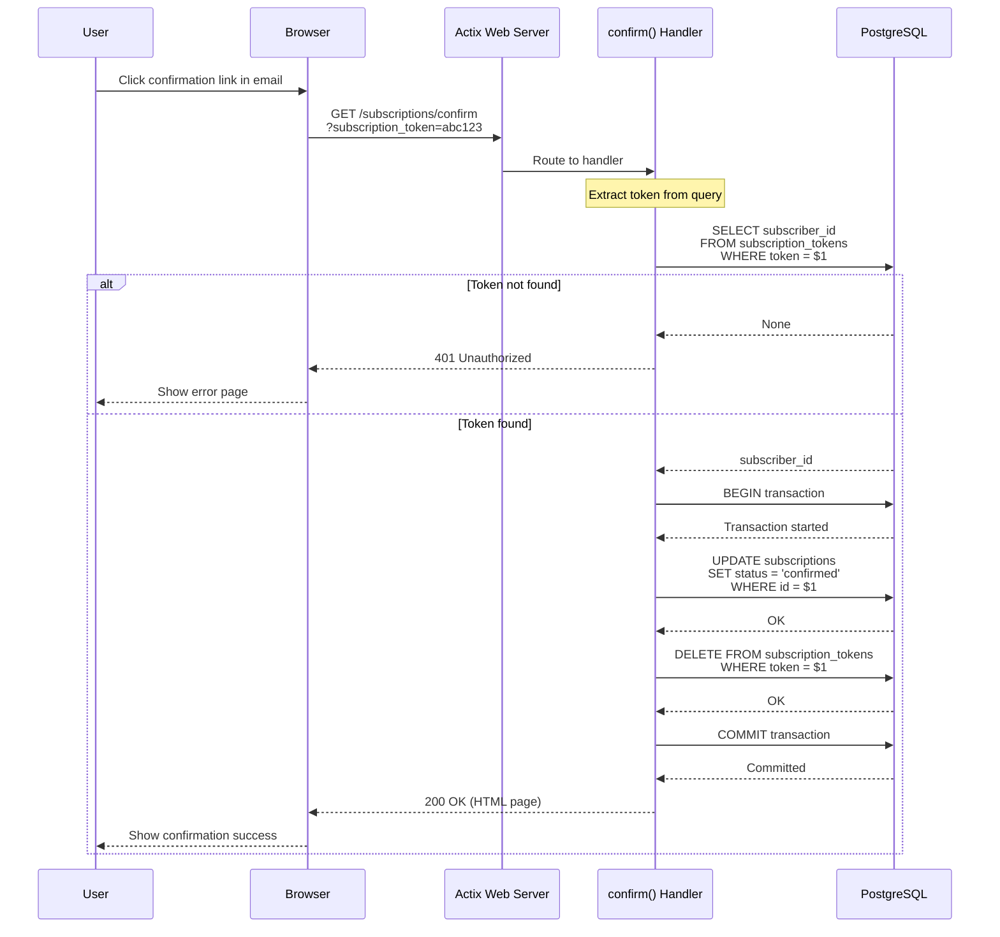
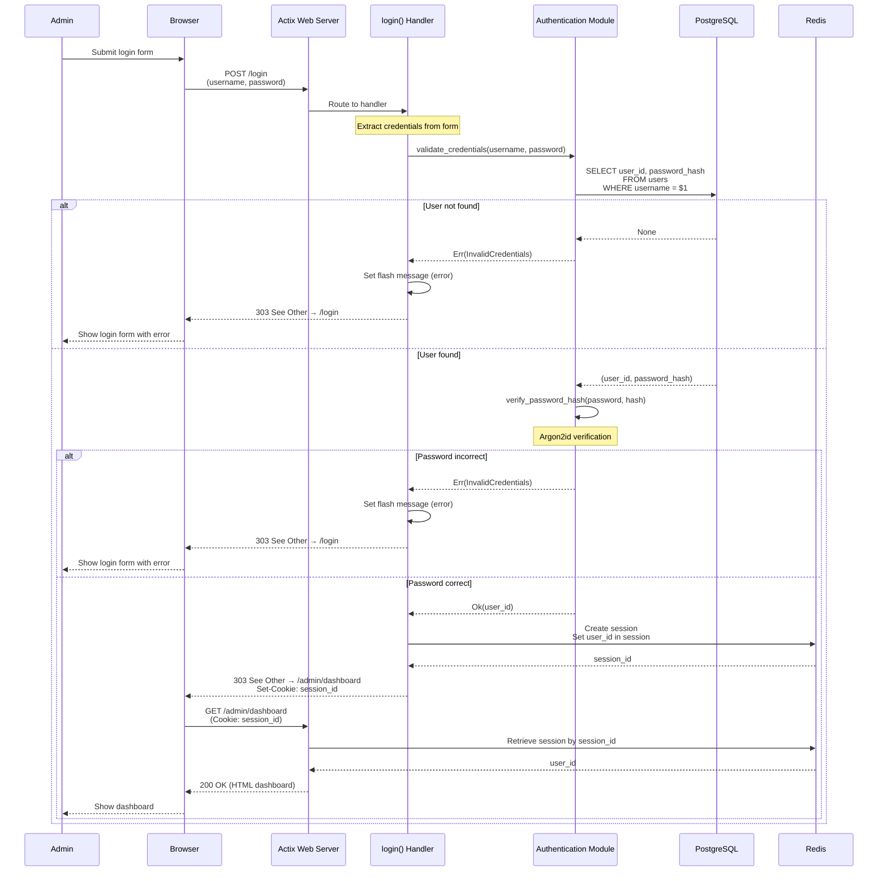
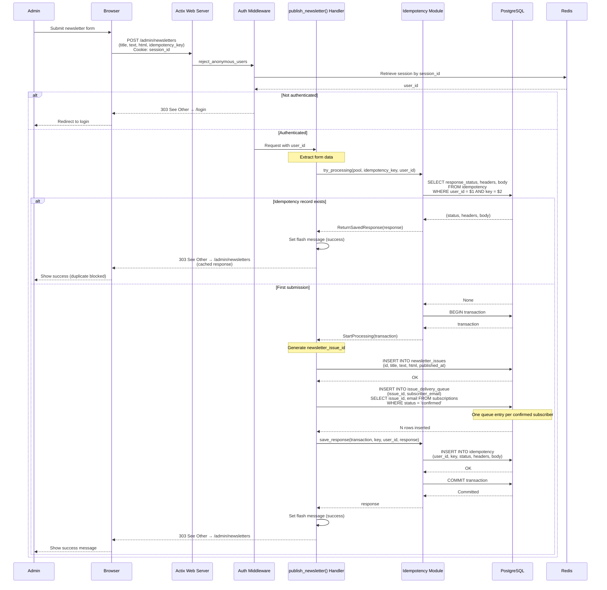
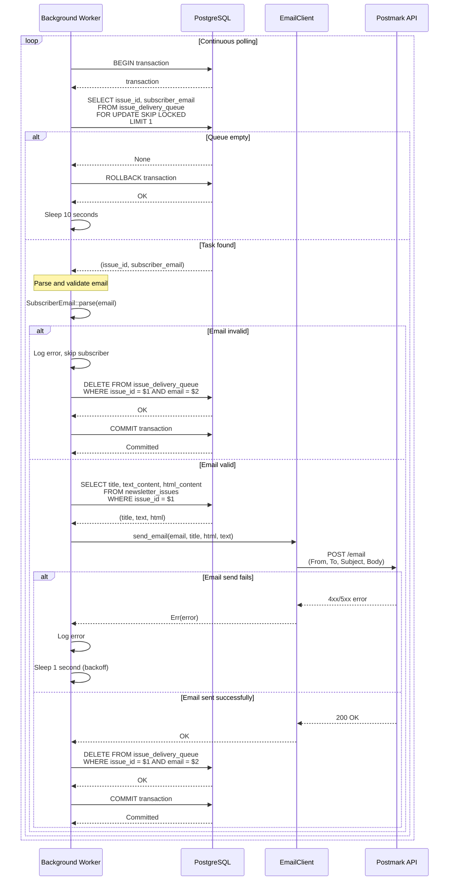
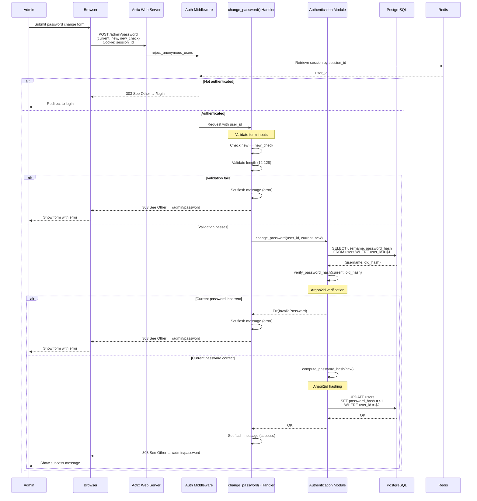
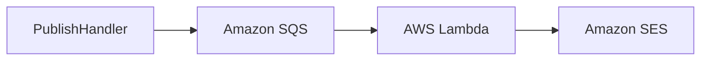

# Interaction Diagrams

## Overview

This document contains sequence diagrams showing how key business transactions are implemented across components in the zero2prod system.

---

## 1. Subscription Registration Flow

**Business Transaction**: User subscribes to newsletter with email confirmation



**Key Components**:
- **Route Handler**: `src/routes/subscriptions.rs::subscribe()`
- **Domain Validation**: `src/domain/subscriber_email.rs`, `src/domain/subscriber_name.rs`
- **Database Operations**: `insert_subscriber()`, `store_token()`
- **Email Client**: `src/email_client.rs::send_email()`

---

## 2. Email Confirmation Flow

**Business Transaction**: User confirms subscription via email link



**Key Components**:
- **Route Handler**: `src/routes/subscriptions_confirm.rs::confirm()`
- **Database Operations**: Token lookup, status update, token deletion

---

## 3. Admin Login Flow

**Business Transaction**: Admin authenticates and creates session



**Key Components**:
- **Route Handler**: `src/routes/login/post.rs::login()`
- **Authentication**: `src/authentication/password.rs::validate_credentials()`, `verify_password_hash()`
- **Session Management**: `src/session_state.rs` with Redis storage

---

## 4. Newsletter Publishing Flow (with Idempotency)

**Business Transaction**: Admin publishes newsletter issue to all confirmed subscribers



**Key Components**:
- **Route Handler**: `src/routes/admin/newsletter/post.rs::publish_newsletter()`
- **Auth Middleware**: `src/authentication/middleware.rs::reject_anonymous_users()`
- **Idempotency**: `src/idempotency/persistence.rs::try_processing()`, `save_response()`
- **Database Operations**: `insert_newsletter_issue()`, `enqueue_delivery_tasks()`

---

## 5. Background Email Delivery Flow

**Business Transaction**: Async worker processes newsletter delivery queue



**Key Components**:
- **Worker**: `src/issue_delivery_worker.rs::worker_loop()`, `try_execute_task()`
- **Queue Operations**: `dequeue_task()`, `delete_task()`
- **Content Retrieval**: `get_issue()`
- **Email Client**: `src/email_client.rs::send_email()`

**Concurrency Safety**:
- `FOR UPDATE SKIP LOCKED` prevents multiple workers from processing the same task
- Transaction ensures atomic dequeue + send + delete

---

## 6. Password Change Flow

**Business Transaction**: Admin changes their password



**Key Components**:
- **Route Handler**: `src/routes/admin/password/post.rs::change_password()`
- **Auth Module**: `src/authentication/password.rs::change_password()`, `verify_password_hash()`, `compute_password_hash()`

---

## Component Interaction Summary

### Component Communication Patterns

| Source Component | Target Component | Communication Type | Protocol |
|-----------------|------------------|-------------------|----------|
| Route Handlers | Domain Layer | Function Call | In-process |
| Route Handlers | PostgreSQL | SQL Query | PostgreSQL wire protocol |
| Route Handlers | Redis | Session Operations | RESP protocol (via actix-session) |
| Route Handlers | Email Client | Method Call | In-process |
| Email Client | Postmark API | HTTP POST | HTTPS REST |
| Background Worker | PostgreSQL | SQL Query | PostgreSQL wire protocol |
| Background Worker | Email Client | Method Call | In-process |
| Middleware | Redis | Session Lookup | RESP protocol |

### Data Flow Patterns

**Request-Response (Synchronous)**:
- User → Browser → Web Server → PostgreSQL → Web Server → Browser → User
- Latency-sensitive operations
- Blocking user interaction

**Fire-and-Forget (Asynchronous)**:
- Newsletter Publish → Queue → Background Worker → Email API
- Long-running operations
- Non-blocking user interaction

**Polling (Periodic)**:
- Background Worker continuously polls queue
- 10-second interval on empty queue
- 1-second backoff on errors

---

## Error Handling Patterns

### Retry Strategy

**Email Sending**:
- No automatic retries in application code
- Background worker continues on email failure (logs error)
- Failed tasks remain in queue (idempotent)

**Database Operations**:
- No automatic retries
- Rely on transaction rollback for consistency
- Errors propagated to user via flash messages or error pages

### Circuit Breaker

**Current Implementation**: None

**AWS Modernization Opportunity**: Add circuit breaker for external services using `resilience4j` pattern or AWS App Mesh

---

## Scalability Analysis

### Bottlenecks

1. **Background Worker**:
   - Single polling loop
   - Sequential processing
   - Cannot scale horizontally due to `FOR UPDATE SKIP LOCKED` limitation

2. **Session Storage**:
   - Single Redis instance
   - No automatic failover
   - All sessions lost if Redis crashes

3. **Email API**:
   - Rate-limited by Postmark
   - Sequential sending from single worker

### Scaling Strategies

**Web Tier**:
- ✅ Can scale horizontally (stateless)
- ✅ Load balancer ready (no session affinity needed)
- ✅ Connection pooling handles multiple instances

**Worker Tier**:
- ⚠️ Cannot scale horizontally with current polling model
- 🔄 **AWS Solution**: Replace with SQS + Lambda (automatic scaling)

**Data Tier**:
- ✅ PostgreSQL read replicas for read scaling
- ✅ Redis cluster for session HA
- ✅ RDS for automated backups and failover

---

## Observability in Interactions

### Tracing Spans

**Per-Transaction Spans**:
- `subscribe()` → Database operations → Email sending
- `publish_newsletter()` → Idempotency check → Queue creation
- `try_execute_task()` → Queue dequeue → Email sending

**Span Fields**:
- `subscriber_email`
- `newsletter_issue_id`
- `user_id`

### Log Correlation

**Request ID**: Not implemented (opportunity for X-Ray trace IDs)

**Error Context**: Propagated via `anyhow` with cause chains

---

## AWS Modernization Impact on Interactions

### Proposed Changes

**Queue-Based Worker**:


**Session Management**:
```text
Redis → Amazon ElastiCache (Redis-compatible)
OR
Redis → Amazon DynamoDB (session table)
```

**Database**:
```text
PostgreSQL → Amazon RDS for PostgreSQL
(Minimal code changes, connection string only)
```

**Observability**:
```text
Tracing → AWS X-Ray (via OpenTelemetry)
Logs → CloudWatch Logs
Metrics → CloudWatch Metrics
```
